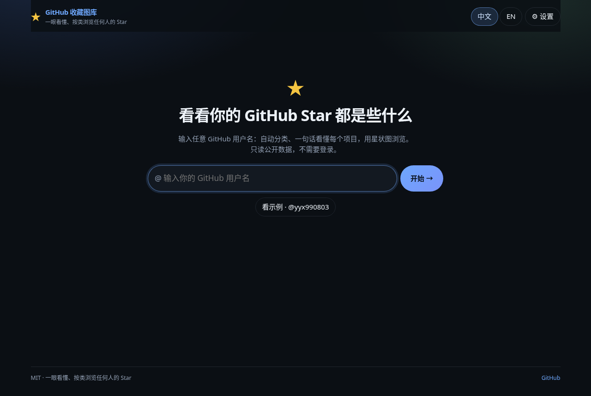
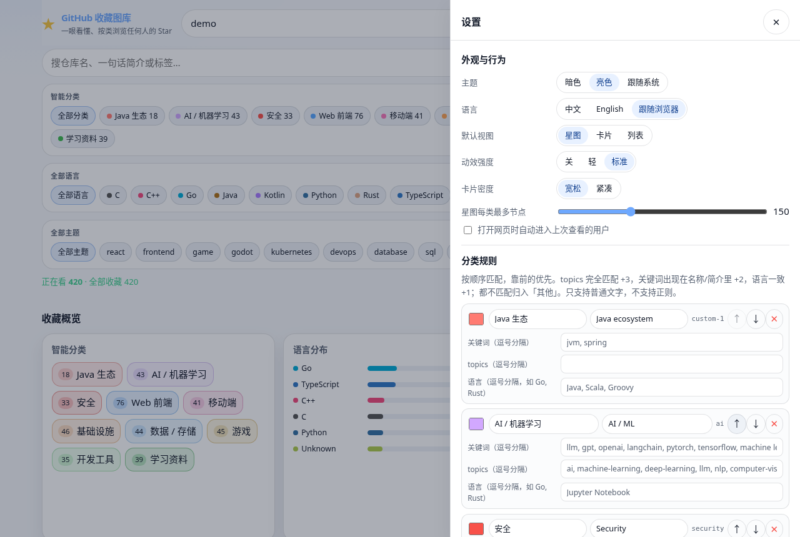
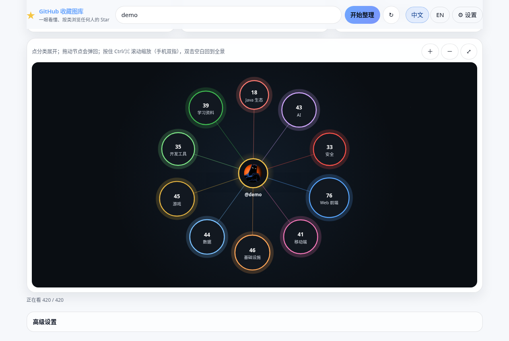

# GitHub Stars Gallery · GitHub 收藏图库

[中文](#中文) · [English](#english)

输入任意 GitHub 用户名，把 TA 的 Star 自动分类成一张会动的星状图：一眼看懂每个项目是干什么的。全部可配置，Fork 一下就能部署成你自己的版本。
*Enter any GitHub username and turn their stars into a living, auto-categorized star map. Fully configurable; fork it to deploy your own.*

**在线预览 / Live demo：** https://godfay-g.github.io/github-stars-gallery/ （打开是欢迎页，输入你自己的用户名 / opens a welcome page — enter your own username）




---

## 中文

### 功能

- **欢迎页**：没带用户名时只显示输入框和一句说明（不发任何 API 请求）；可选「看示例」按钮；「最近查看」一键切换；输入后地址变成 `?user=xxx`，可直接分享。
- **中文默认，可一键切英文**（右上角「中文 / EN」，也可设为跟随浏览器）。
- **设置面板**（右上角 ⚙︎）：主题（暗 / 亮 / 跟随系统）、默认视图、语言、动效强度、卡片密度、星图每类最多节点、自定义分类、手动指定分类、本地标签、导入 / 导出配置、恢复默认。立即生效，星图不重载。
- **人话一句话**：每个仓库优先显示简介，没有简介时按语言、分类、topics 拼一句「这是干什么的」。
- **自动分类**：按 topics、关键词和语言自动分到 AI / Web 前端 / 移动端 / 基础设施 / 数据 / 安全 / 开发工具 / 游戏 / 学习资料 / 其他。规则可以在设置面板或 `config.json` 里增删改，纯前端，不调用模型。
- **灵动星状图**（默认视图）
  - 物理布局：d3-force 驱动，节点轻微呼吸漂浮；可以拖动节点，松手后带惯性弹回原位。
  - 飞散展开：点分类，仓库从分类节点飞散展开，其他分类退到外圈淡出；返回时反向收拢。
  - 悬停简介：高亮节点和连线、其余淡化，浮出头像 + 仓库名 + 一句话 + Star 数。
  - 缩放平移：按住 Ctrl/⌘ 滚动（或触控板捏合）以鼠标位置为中心缩放，普通滚轮照常滚动页面；鼠标拖动平移带惯性；手机上单指照常滚页面，双指平移/捏合缩放；双击空白或 ⤢ 回到全景。
  - 大账号友好：每个分类默认最多展开 150 个节点（可在设置里调），其余折叠成「+N」（点它跳到下方列表）；缩小到 0.6 倍以下时头像换成色点。
  - 尊重系统「减少动态效果」（`prefers-reduced-motion`）：关闭漂浮和惯性，切换即时完成。
- **卡片 / 列表视图与芯片筛选**：搜索（名称、简介、作者、topics、本地标签），按分类 / 语言 / topics 多选芯片筛选，按收藏时间 / Star / 更新时间 / 名称排序；筛选时星图节点平滑进出，页面不闪。
- **概览区**：总数、分类分布、语言分布、最近收藏。
- **本地标签**：给仓库加自己的标签，只存在本机浏览器。
- **高级设置**（默认收起）：填 PAT 提高限流、隐藏 fork、导出、查看剩余配额。
- **导出**：当前筛选结果导出 JSON，或导出可离线搜索的单文件 HTML。
- **CLI**：`npm run export -- <用户名> [--config public/config.json]` 生成 `stars.json` + `stars.html`，分类规则和网页一致。


### 用法

1. 打开在线预览，输入你的 GitHub 用户名，回车。也可以直接打开 `…/github-stars-gallery/?user=<用户名>`。
2. 在星状图上点分类展开；悬停看简介；点仓库在 GitHub 打开。下方卡片随筛选同步，筛选条件会写进地址栏，复制即可分享。
3. 右上角 ⚙︎ 打开设置：改主题、自定义分类、导出配置等。点卡片上的分类标签可以手动改分类。
4. 遇到限流时，在「高级设置」里填 PAT。数据在本机缓存约 15 分钟，↻ 强制刷新。



### PAT：最小权限与限流

只读公开 Star，**不需要任何写权限**：

- Classic token：不勾选任何 scope 即可。
- Fine-grained token：Repository access 选 **Public repositories (read-only)**，不需要额外权限。

| 模式 | 大约限流 |
|------|----------|
| 匿名 | 约 60 次 / 小时 / IP |
| 带 PAT | 约 5,000 次 / 小时 |

每页 100 个 Star，1,000 个 Star 约 10 次请求。Token 只存在浏览器 `localStorage`（`gsg:pat`），只发给 `api.github.com`。不要把 Token 提交进仓库。

### 配置

所有配置都是**按字段**合并的，优先级从高到低：

**URL 参数 > 本机设置（设置面板，localStorage）> `config.json`（部署者）> 内置默认值**

例如部署者在 `config.json` 里把默认视图设成 `list`，访客在设置里改成「卡片」，那他看到的就是卡片；如果分享链接里带了 `view=map`，打开链接的人看到的是星图。URL、`config.json` 和导入文件都不可信：先校验，未知字段丢弃，非法值回退默认，页面顶部给出提示，不会白屏。

#### URL 参数（可分享）

| 参数 | 示例 | 说明 |
|------|------|------|
| `user` | `?user=octocat` | 要查看的 GitHub 用户名 |
| `view` | `map` / `cards` / `list` | 视图（`card` 也可以） |
| `lang` | `zh` / `en` | 界面语言（只影响这次打开） |
| `theme` | `dark` / `light` / `system` | 主题（只影响这次打开） |
| `q` | `q=react` | 搜索词 |
| `lang_filter` | `lang_filter=Go,Rust` | 按编程语言筛选，逗号分隔 |
| `topics` | `topics=cli,llm` | 按 topics 筛选 |
| `cat` | `cat=ai,web` | 按分类 id 筛选 |
| `sort` | `starred_at` / `stars` / `updated` / `name` | 排序 |

换用户会新增一条浏览记录（可以后退）；搜索和筛选只替换当前地址（约 300ms 防抖）。PAT **永远不会**出现在 URL 或导出的配置文件里。

#### `public/config.json`（部署时配置）

运行时用相对路径 `./config.json` 读取，改完不用重新构建。文件不存在就用内置默认值。字段说明见 [`public/config.schema.json`](public/config.schema.json)（编辑器会自动提示）。

| 字段 | 类型 | 说明 |
|------|------|------|
| `version` | `1` | 配置版本，以后升级会自动迁移 |
| `site.title` / `site.subtitle` | 文字或 `{ "zh", "en" }` | 站点标题 / 副标题 |
| `site.logo` | 文字或图片地址 | 一个 emoji / 短文字，或 http(s) / 相对路径图片 |
| `site.sourceUrl` | URL 或 `""` | 页脚「GitHub」链接，空字符串隐藏 |
| `defaultUser` | 用户名或 `""` | 没带 `?user=` 时自动打开的用户；**留空 = 显示欢迎页** |
| `exampleUser` | 用户名或 `""` | 欢迎页「看示例」按钮；留空则隐藏（会回退到 `defaultUser`） |
| `accentColor` | `#rgb` / `#rrggbb` | 主色 |
| `hidePatInput` | `true` / `false` | 隐藏「填 PAT」按钮 |
| `basePath` | `""` 或 `/path/` | 分享链接用的路径；一般留空（自动用当前路径） |
| `defaults.lang` | `zh` / `en` / `auto` | 默认语言 |
| `defaults.theme` | `dark` / `light` / `system` | 默认主题 |
| `defaults.view` | `map` / `card` / `list` | 默认视图 |
| `defaults.sort` | `starred_at` / `stars` / `updated` / `name` | 默认排序 |
| `defaults.motion` | `off` / `light` / `standard` | 动效强度 |
| `defaults.density` | `comfortable` / `compact` | 卡片密度 |
| `defaults.maxNodesPerCategory` | 20–400 | 星图每个分类最多展开的节点数 |
| `defaults.autoOpenLastUser` | `true` / `false` | 打开时自动进入上次查看的用户（默认关） |
| `categoriesMode` | `merge` / `replace` | `merge`：按 id 合并到内置分类；`replace`：完全替换 |
| `categories` | 数组 | 分类规则，见下 |

示例：

```json
{
  "version": 1,
  "site": { "title": { "zh": "我们团队的 Star", "en": "Team Stars" }, "logo": "🚀", "sourceUrl": "" },
  "defaultUser": "",
  "exampleUser": "octocat",
  "accentColor": "#22c55e",
  "hidePatInput": false,
  "defaults": { "lang": "auto", "theme": "system", "view": "map" }
}
```

#### 自定义分类

规则只认**普通文字**，不支持正则：topics 完全匹配 +3 分，关键词出现在仓库名 / 简介里 +2 分，语言一致 +1 分；得分最高的分类胜出，同分时排在前面的优先，都不匹配归入「其他」（`other` 始终在最后）。

```json
{
  "categoriesMode": "merge",
  "categories": [
    { "id": "ai", "label": { "zh": "人工智能", "en": "AI" }, "color": "#a371f7" },
    {
      "id": "jvm",
      "label": { "zh": "Java 生态", "en": "JVM" },
      "color": "#f0883e",
      "keywords": ["jvm", "spring"],
      "topics": ["java", "kotlin"],
      "languages": ["Java", "Scala", "Groovy"]
    }
  ]
}
```

第一条只改内置 `ai` 分类的名字和颜色（关键词保留），第二条新增一个分类。访客也可以在设置面板里改，改动存本机，可以导出 / 导入 JSON 分享给别人。



### Fork 部署自己的版本

1. **Fork** 本仓库，编辑 `public/config.json`：改标题、logo、示例用户、分类；想让首页直接打开某个人就填 `defaultUser`。
2. **开启 Pages**：Settings → Pages → Source 选 **GitHub Actions**；Settings → Actions → General → Workflow permissions 选 **Read and write**。
3. **推送到 `main`**：自动构建部署到 `https://<你的用户名>.github.io/<仓库名>/`。仓库名随便改，路径是相对的，不用改代码。

### 本地开发

需要 Node.js 18+（CI 用 20）。

```bash
npm ci
npm test         # vitest：API、星图布局/相机、配置校验/合并/URL/分类
npm run dev      # http://localhost:5173
npm run build    # 输出 dist/
npm run preview
```

CLI 导出：

```bash
export GITHUB_TOKEN=ghp_xxx                                   # 可选
npm run export -- octocat                                     # → data/stars.json + data/stars.html
npm run export -- octocat --config public/config.json --lang en --out out
npm run export -- --config my-config.json                     # 用配置里的 defaultUser
```

### 部署

- **CI**（[`.github/workflows/ci.yml`](.github/workflows/ci.yml)）：每个指向 `main` 的 PR 跑 `npm ci` → `npm test` → `npm run build`。
- **Pages**（[`.github/workflows/pages.yml`](.github/workflows/pages.yml)）：推到 `main` 后自动构建并用 GitHub Pages Actions 部署；也可 `gh workflow run pages.yml` 手动触发。
- Fork 后的设置见上面「Fork 部署自己的版本」。

### 项目结构

```
public/
  config.json          部署配置（运行时读取）
  config.schema.json   编辑器提示用的 JSON Schema
src/
  main.ts              页面状态、渲染、事件、URL 同步（星图只挂载一次）
  config/schema.ts     配置的唯一定义：类型、默认值、校验、迁移、合并、分类匹配（网页和 CLI 共用）
  config/store.ts      localStorage 读写、config.json 加载、主题
  ui/settings.ts       设置面板
  i18n.ts / i18n-config.ts  中英文案
  types.ts
  api/                 GitHub API 客户端（star+json 分页、限流等待、15 分钟缓存）+ 单测
  lib/                 categories（当前规则 / 一句话）、standalone（单文件 HTML）、filter、export、format、html
  state/tags.ts        本地标签
  starmap/
    StarMap.ts         星状图：d3-force 物理、rAF 渲染、相机、指针/捏合、悬停 tooltip
    layout.ts          环形 / 向日葵布局、150 上限、拖拽阈值
    camera.ts          鼠标中心缩放、惯性衰减、fit
    starmap.css
    starmap.test.ts
  styles/main.css
scripts/export.ts      CLI 导出（export.mjs 是兼容入口）
docs/screenshots/      截图与演示录屏
.github/workflows/     ci.yml、pages.yml
```

### License

[MIT](LICENSE)

---

## English

A static web app that turns any GitHub user's stars into an auto-categorized, animated star map plus a searchable card gallery. No server; deploys on GitHub Pages; everything is configurable.

### Features

- **Welcome page**: without `?user=` you get just an input and a one-line explanation (no API calls). Optional "See an example" button, "Recently viewed" chips, and the URL becomes `?user=xxx` so it can be shared.
- **Settings panel** (⚙︎, top right): theme (dark / light / system), default view, language, motion, card density, max nodes per category, custom categories, manual category assignment, local tags, import / export settings JSON, reset. Applied live; the star map is never re-mounted.
- **One-line "what is this"** for every repo.
- **Auto categories** from topics, keywords and language — editable in the settings panel or `config.json`.
- **Fluid star map**: d3-force physics, burst expand, hover cards, Ctrl/⌘ + wheel or pinch to zoom (a plain wheel scrolls the page), inertia, `prefers-reduced-motion` support.
- **Cards / list + chip filters**, overview, local tags, JSON / standalone HTML export, and a CLI that uses the same category rules.

### Configuration

Merged **per field**, highest priority first: **URL parameters > local settings (settings panel) > `config.json` (deployer) > built-in defaults**. All three external sources are untrusted: they are validated, unknown fields are dropped, invalid values fall back to defaults and a notice is shown.

**URL parameters**: `user`, `view` (`map`/`cards`/`list`), `lang` (`zh`/`en`), `theme` (`dark`/`light`/`system`), `q`, `lang_filter` (comma list), `topics` (comma list), `cat` (category ids), `sort` (`starred_at`/`stars`/`updated`/`name`). Changing user pushes a history entry; search/filters replace it (300 ms debounce). The PAT never goes into the URL or exported settings.

**`public/config.json`** is fetched at runtime from `./config.json` (relative, no rebuild needed; missing file = defaults). Fields: `version`, `site.{title,subtitle,logo,sourceUrl}`, `defaultUser` (empty = welcome page), `exampleUser` (empty = no example button), `accentColor`, `hidePatInput`, `basePath`, `defaults.{lang,theme,view,sort,motion,density,maxNodesPerCategory,autoOpenLastUser}`, `categoriesMode` (`merge`/`replace`), `categories`. See the table and examples in the Chinese section and [`config.schema.json`](public/config.schema.json).

**Custom categories** use plain text only (no regex): topic match +3, keyword in name/description +2, language match +1; highest score wins, ties go to the earlier rule, no match → `other`.

### Fork & deploy your own

1. **Fork** and edit `public/config.json` (title, logo, example user, categories; set `defaultUser` to open someone directly).
2. **Enable Pages**: Settings → Pages → Source **GitHub Actions**; Settings → Actions → General → Workflow permissions **Read and write**.
3. **Push to `main`**: it deploys to `https://<you>.github.io/<repo>/`. Any repo name works — all paths are relative.

### PAT: minimum permissions & rate limits

Reading public stars needs **no write access** (classic token with no scopes, or fine-grained with *Public repositories (read-only)*). Anonymous ≈ 60 requests/hour/IP, with PAT ≈ 5,000/hour; 100 stars per request. The token lives only in `localStorage` (`gsg:pat`) and is only sent to `api.github.com`.

### Local development

Node.js 18+ (CI uses 20).

```bash
npm ci
npm test
npm run dev      # http://localhost:5173
npm run build    # → dist/
npm run export -- octocat --config public/config.json   # → data/stars.json + data/stars.html
```

### License

[MIT](LICENSE)
