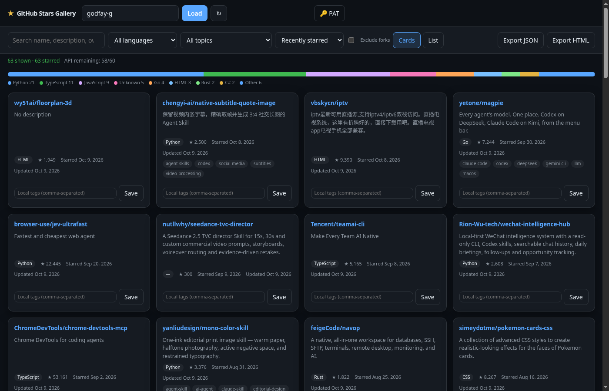

# GitHub Stars Gallery

[English](#english) · [中文](#中文)

Turn a GitHub user’s starred repositories into a searchable, filterable gallery. Pure static front-end — deploy on GitHub Pages, optional PAT for higher rate limits, export JSON / offline HTML.

**Live demo:** https://godfay-g.github.io/github-stars-gallery/?user=godfay-g  
**Repo:** https://github.com/godfay-g/github-stars-gallery



---

## English

### Features

- Load public stars by username (`?user=octocat`)
- Pagination via GitHub REST (`Accept: application/vnd.github.star+json` → `starred_at`)
- Optional PAT in `localStorage` (never sent anywhere except GitHub API)
- Progress + rate-limit hints; 15‑minute cache in `localStorage`
- Search (name / description / owner / topics / local tags)
- Filter by language & topic; sort by starred / stars / updated / name
- Card & list views; language distribution bar
- Local custom tags (browser only)
- Export filtered results as JSON or standalone searchable HTML
- CLI: `node scripts/export.mjs <user>`

### Quick start (web)

1. Open the Pages URL (or run locally below).
2. Enter a GitHub username → **Load**.
3. Optional: click **PAT** and paste a token if you hit rate limits.

### Local development

```bash
npm install
npm run dev      # http://localhost:5173
npm run build
npm run preview
```

### CLI export

```bash
# anonymous (60 req/h) or with token
export GITHUB_TOKEN=ghp_xxx   # optional
node scripts/export.mjs godfay-g
# → data/stars.json + data/stars.html
```

### PAT & privacy

| Mode | Approx. rate limit |
|------|--------------------|
| Anonymous | ~60 requests / hour / IP |
| Authenticated | ~5,000 requests / hour |

**Minimum scopes**

- Classic: `public_repo` (or omit scopes for public read-only fine-grained)
- Fine-grained: Repository permissions → Contents **Read-only** (public repos); no write scopes needed

The token is stored only in your browser `localStorage` under `gsg:pat`. This app does not phone home. Do not commit tokens.

### Deploy (GitHub Pages)

**Primary path:** GitHub Actions builds `dist/` on every push to `main` (and on manual dispatch) and deploys via the official Pages actions. Workflow: [`.github/workflows/pages.yml`](.github/workflows/pages.yml).

Requirements once (repo Settings):

1. **Actions → General → Workflow permissions** → **Read and write**
2. **Pages → Build and deployment → Source** → **GitHub Actions**

Then push to `main`, or run:

```bash
gh workflow run pages.yml
```

Site URL: https://godfay-g.github.io/github-stars-gallery/

#### Appendix: legacy `gh-pages` branch

Earlier demos used a `gh-pages` branch with a prebuilt `dist/`. Prefer Actions above. If you still need a manual static push:

```bash
npm run build
git subtree push --prefix dist origin gh-pages
```

A copy of the workflow sample also lives at [`docs/pages.workflow.yml`](docs/pages.workflow.yml).

---

## 中文

把任意 GitHub 账号的 Star 仓库整理成可搜索、可筛选的图库。纯前端静态站，可部署到 GitHub Pages；可选 PAT 提高限流；支持导出 JSON / 离线 HTML。

### 功能

- 输入用户名拉取公开 Star（支持 `?user=`）
- 分页调用 GitHub API，带 `starred_at`
- PAT 仅存本机 `localStorage`
- 进度与限流提示；本地缓存约 15 分钟
- 搜索、语言 / topics 筛选、排序、卡片/列表、语言分布条
- 本地自定义标签（不写回 GitHub）
- 导出 JSON 与可离线搜索的单文件 HTML
- CLI：`node scripts/export.mjs <user>`

### 本地开发

```bash
npm install
npm run dev
npm run build
```

### PAT 与隐私

| 模式 | 大约限流 |
|------|----------|
| 匿名 | 约 60 次 / 小时 / IP |
| 已登录（PAT） | 约 5,000 次 / 小时 |

**最小权限**

- Classic：`public_repo`（或公开只读可不勾写权限）
- Fine-grained：Repository permissions → Contents **Read-only**（公开仓库）；无需写权限

Token 只存在浏览器 `localStorage`（键名 `gsg:pat`），不会发到第三方。请勿把 Token 提交进仓库。

### 部署（GitHub Pages）

**主路径：** 推送到 `main`（或手动 `workflow_dispatch`）后，Actions 构建 `dist/` 并部署。工作流：[`.github/workflows/pages.yml`](.github/workflows/pages.yml)。

仓库设置一次性准备：

1. **Actions → General → Workflow permissions** → **Read and write**
2. **Pages → Build and deployment → Source** → **GitHub Actions**

```bash
gh workflow run pages.yml
```

演示地址：https://godfay-g.github.io/github-stars-gallery/

#### 附录：旧版 `gh-pages` 分支

早期演示用过 `gh-pages` 分支直接托管构建产物。请优先用上面的 Actions。如仍需手工推静态文件：

```bash
npm run build
git subtree push --prefix dist origin gh-pages
```

### License

MIT
