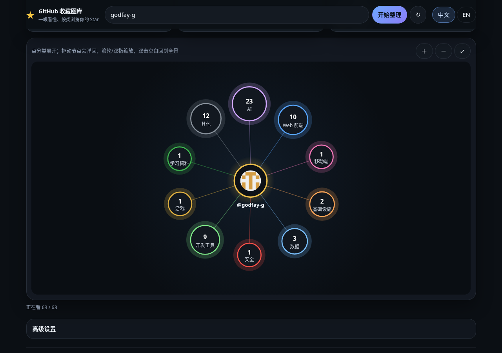
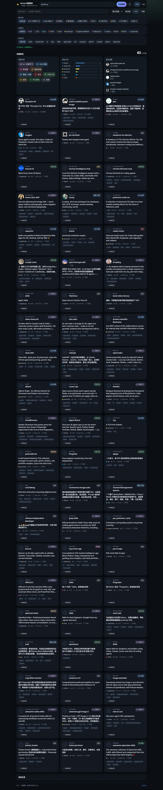

# GitHub Stars Gallery · GitHub 收藏图库

[中文](#中文) · [English](#english)

把你点过的 GitHub Star 自动分类成一张会动的星状图：一眼看懂每个项目是干什么的，不再让收藏变成垃圾堆。
*Turn your GitHub stars into a living, auto-categorized star map — see at a glance what every repo does.*

**在线预览 / Live demo：** https://godfay-g.github.io/github-stars-gallery/?user=godfay-g



---

## 中文

### 功能

- **中文默认，可一键切英文**（右上角「中文 / EN」，选择记在本机）。
- **人话一句话**：每个仓库优先显示简介，没有简介时按语言、分类、topics 拼一句「这是干什么的」。
- **自动分类**：加载后按 topics、关键词和语言自动分到 AI / Web 前端 / 移动端 / 基础设施 / 数据 / 安全 / 开发工具 / 游戏 / 学习资料 / 其他。纯前端规则，不调用模型。
- **灵动星状图**（默认视图）
  - 物理布局：d3-force 驱动，节点轻微呼吸漂浮；可以拖动节点，松手后带惯性弹回原位。
  - 飞散展开：点分类，仓库从分类节点飞散展开，其他分类退到外圈淡出；返回时反向收拢。
  - 悬停简介：高亮节点和连线、其余淡化，浮出头像 + 仓库名 + 一句话 + Star 数。
  - 缩放平移：按住 Ctrl/⌘ 滚动（或触控板捏合）以鼠标位置为中心缩放，普通滚轮照常滚动页面；鼠标拖动平移带惯性；手机上单指照常滚页面，双指平移/捏合缩放；双击空白或 ⤢ 回到全景。
  - 大账号友好：每个分类最多展开约 150 个节点，其余折叠成「+N」（点它跳到下方列表）；缩小到 0.6 倍以下时头像换成色点。
  - 尊重系统「减少动态效果」（`prefers-reduced-motion`）：关闭漂浮和惯性，切换即时完成。
- **卡片 / 列表视图与芯片筛选**：搜索（名称、简介、作者、topics、本地标签），按分类 / 语言 / topics 多选芯片筛选，按收藏时间 / Star / 更新时间 / 名称排序；筛选时星图节点平滑进出，页面不闪。
- **概览区**：总数、分类分布、语言分布、最近收藏。
- **本地标签**：给仓库加自己的标签，只存在本机浏览器。
- **高级设置**（默认收起）：填 PAT 提高限流、隐藏 fork、导出、查看剩余配额。
- **导出**：当前筛选结果导出 JSON，或导出可离线搜索的单文件 HTML。
- **CLI**：`node scripts/export.mjs <用户名>` 直接生成 `stars.json` + `stars.html`。



### 用法

1. 打开在线预览，或带上用户名：`https://godfay-g.github.io/github-stars-gallery/?user=<GitHub 用户名>`。
2. 在顶部输入用户名，点「开始整理」。
3. 在星状图上点分类展开；悬停看简介；点仓库在 GitHub 打开。下方卡片随筛选同步。
4. 遇到限流时，在「高级设置」里填 PAT。数据在本机缓存约 15 分钟，↻ 强制刷新。

### PAT：最小权限与限流

只读公开 Star，**不需要任何写权限**：

- Classic token：不勾选任何 scope 即可。
- Fine-grained token：Repository access 选 **Public repositories (read-only)**，不需要额外权限。

| 模式 | 大约限流 |
|------|----------|
| 匿名 | 约 60 次 / 小时 / IP |
| 带 PAT | 约 5,000 次 / 小时 |

每页 100 个 Star，1,000 个 Star 约 10 次请求。Token 只存在浏览器 `localStorage`（`gsg:pat`），只发给 `api.github.com`。不要把 Token 提交进仓库。

### 本地开发

需要 Node.js 18+（CI 用 20）。

```bash
npm ci
npm test         # vitest：API 分页/限流 + 星图布局/相机单测
npm run dev      # http://localhost:5173
npm run build    # 输出 dist/
npm run preview
```

CLI 导出：

```bash
export GITHUB_TOKEN=ghp_xxx          # 可选
node scripts/export.mjs godfay-g     # → data/stars.json + data/stars.html
node scripts/export.mjs godfay-g --out out
```

### 部署

- **CI**（[`.github/workflows/ci.yml`](.github/workflows/ci.yml)）：每个指向 `main` 的 PR 跑 `npm ci` → `npm test` → `npm run build`。
- **Pages**（[`.github/workflows/pages.yml`](.github/workflows/pages.yml)）：推到 `main` 后自动构建并用 GitHub Pages Actions 部署；也可 `gh workflow run pages.yml` 手动触发。
- Fork 后首次设置：Settings → Pages → Source 选 **GitHub Actions**；Settings → Actions → General → Workflow permissions 选 **Read and write**。

### 项目结构

```
src/
  main.ts              页面状态、渲染、事件（星图只挂载一次）
  i18n.ts              中英文案
  types.ts
  api/                 GitHub API 客户端（star+json 分页、限流等待、15 分钟缓存）+ 单测
  lib/                 categories（自动分类 / 一句话）、filter、export、format、html
  state/tags.ts        本地标签
  starmap/
    StarMap.ts         星状图：d3-force 物理、rAF 渲染、相机、指针/捏合、悬停 tooltip
    layout.ts          环形 / 向日葵布局、150 上限、拖拽阈值
    camera.ts          鼠标中心缩放、惯性衰减、fit
    starmap.css
    starmap.test.ts
  styles/main.css
scripts/export.mjs     CLI 导出
docs/screenshots/      截图与演示录屏
.github/workflows/     ci.yml、pages.yml
```

### License

[MIT](LICENSE)

---

## English

A static web app that turns any GitHub user's stars into an auto-categorized, animated star map plus a searchable card gallery. No server, deploys on GitHub Pages.

### Features

- **Chinese by default, English one click away** (top-right toggle, remembered locally).
- **One-line "what is this"**: the repo description, or a generated sentence from language, category and topics when there is none.
- **Auto categories**: AI, Web, Mobile, Infrastructure, Data, Security, Tools, Games, Learning, Other — rule-based from topics, keywords and language (no model calls).
- **Fluid star map** (default view)
  - Physics layout with d3-force; nodes gently breathe; drag a node and it springs back with inertia.
  - Burst expand: click a category and its repos fly out of it while other categories retreat and fade; back reverses it.
  - Hover: highlights the node and its links, dims the rest, and floats a card with avatar, name, one-liner and stars.
  - Hold Ctrl/⌘ and scroll (or pinch on a trackpad) for cursor-centred zoom; a plain wheel still scrolls the page. Mouse drag pans with inertia. On phones one finger scrolls the page and two fingers pan/pinch. Double-click empty space or ⤢ to fit.
  - Scales to big accounts: up to ~150 repo nodes per category, the rest fold into a "+N" node; below 0.6× zoom avatars become colour dots.
  - Honours `prefers-reduced-motion`: no floating or inertia, instant transitions.
- **Cards / list + chip filters**: search (name, description, owner, topics, local tags), multi-select category / language / topic chips, sort by starred / stars / updated / name. The map updates smoothly, without page flicker.
- **Overview**: totals, category and language breakdown, recent stars.
- **Local tags** kept in your browser only.
- **Advanced settings** (collapsed): PAT, hide forks, export, remaining quota.
- **Export** the filtered set as JSON or a standalone searchable HTML file.
- **CLI**: `node scripts/export.mjs <user>` writes `stars.json` + `stars.html`.

### Usage

1. Open the demo or `https://godfay-g.github.io/github-stars-gallery/?user=<username>`.
2. Enter a username and load.
3. Click a category to expand, hover for details, click a repo to open it on GitHub.
4. If you hit the rate limit, add a PAT under Advanced settings. Results are cached locally for ~15 minutes; ↻ forces a refresh.

### PAT: minimum permissions & rate limits

Reading public stars needs **no write access**:

- Classic token: no scopes.
- Fine-grained token: Repository access → **Public repositories (read-only)**, no extra permissions.

| Mode | Approx. limit |
|------|---------------|
| Anonymous | ~60 requests / hour / IP |
| With PAT | ~5,000 requests / hour |

100 stars per request, so 1,000 stars ≈ 10 requests. The token lives only in your browser's `localStorage` (`gsg:pat`) and is only sent to `api.github.com`.

### Local development

Node.js 18+ (CI uses 20).

```bash
npm ci
npm test         # vitest
npm run dev      # http://localhost:5173
npm run build    # → dist/
npm run preview
```

CLI:

```bash
export GITHUB_TOKEN=ghp_xxx          # optional
node scripts/export.mjs godfay-g     # → data/stars.json + data/stars.html
```

### Deployment

- **CI** ([`ci.yml`](.github/workflows/ci.yml)): every PR to `main` runs `npm ci`, `npm test`, `npm run build`.
- **Pages** ([`pages.yml`](.github/workflows/pages.yml)): every push to `main` builds and deploys via GitHub Pages Actions (or `gh workflow run pages.yml`).
- After forking: Settings → Pages → Source **GitHub Actions**; Settings → Actions → General → Workflow permissions **Read and write**.

### Project structure

See the tree in the Chinese section above. The star map lives in `src/starmap/` (`StarMap.ts` for physics/rendering/input, `layout.ts` and `camera.ts` for pure, unit-tested helpers).

### License

[MIT](LICENSE)
